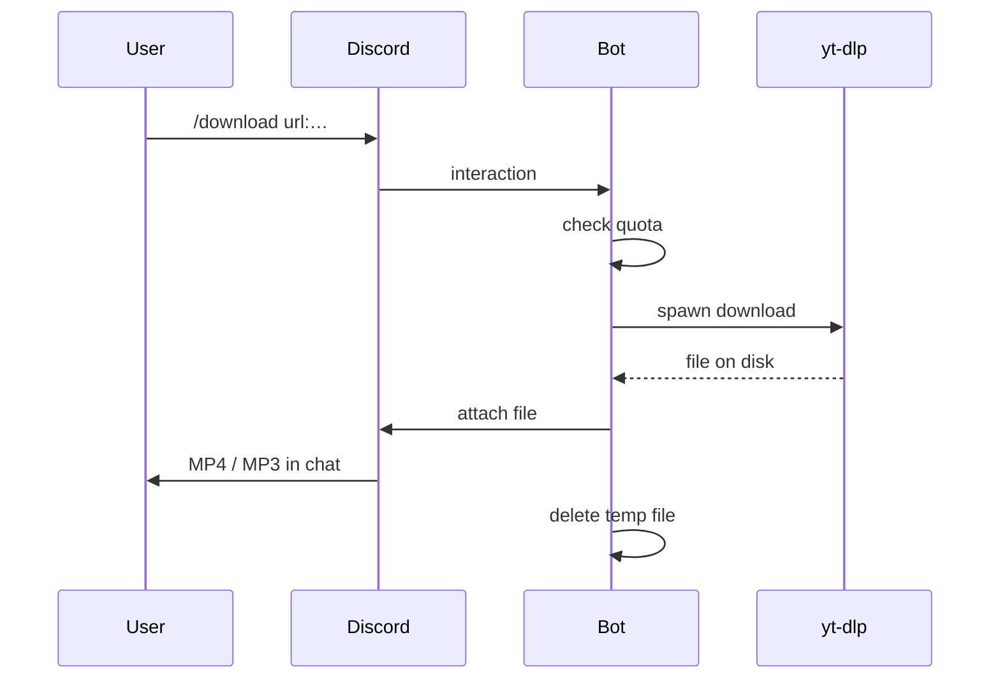

# Clipper Discord Bot

[](https://github.com/Cincinnatus101010/Clipper-Discord-Bot-/actions/workflows/ci.yml)
[](LICENSE)
[](https://bun.sh)
[](docker-compose.yml)

A lightweight Discord bot that downloads media with [yt-dlp](https://github.com/yt-dlp/yt-dlp) and delivers files directly in chat. No backend, no database — TypeScript, Bun, and subprocess calls.

Portfolio project demonstrating Discord slash commands, interactive components, CLI integration, and containerized deployment.

## Features

- **`/download`** — YouTube, Twitch, TikTok, Instagram. MP4 or MP3, optional trim.
- **`/search`** — YouTube search with a select menu, or instant download with `pick:N`.
- **Rate limiting** — Per-user daily quota persisted to disk.
- **Docker-ready** — Single `docker compose up` with standalone yt-dlp, ffmpeg, and Bun (no Python).

## Stack

TypeScript · Bun · discord.js · yt-dlp · ffmpeg · Docker

## How it works



## Quick start (Docker)

**Recommended for production.**

1. [Create a Discord application](https://discord.com/developers/applications) → **Bot** → copy token and Application ID.
2. OAuth2 → URL Generator → scopes `bot` + `applications.commands` → invite to your server.

```bash
git clone https://github.com/Cincinnatus101010/Clipper-Discord-Bot-.git
cd Clipper-Discord-Bot-
cp .env.example .env          # add DISCORD_BOT_TOKEN and DISCORD_CLIENT_ID

docker compose up -d --build  # registers slash commands, then starts the bot
docker compose logs -f bot
```

| Command | Description |
|---------|-------------|
| `make up` | Build and start in the background |
| `make logs` | Follow bot logs |
| `make register` | Re-register slash commands only |
| `make down` | Stop and remove the container |

Quota data persists in the `clipper-discord-bot-data` Docker volume. For TikTok/Instagram, see [cookies/README.md](cookies/README.md).

## Quick start (local)

**Prerequisites:** [Bun](https://bun.sh), [yt-dlp](https://github.com/yt-dlp/yt-dlp), [ffmpeg](https://ffmpeg.org/)

```bash
cp .env.example .env
bun install
bun run register-commands
bun run start
```

## Configuration

| Variable | Required | Description |
|----------|----------|-------------|
| `DISCORD_BOT_TOKEN` | yes | Bot token |
| `DISCORD_CLIENT_ID` | yes | Application ID |
| `DISCORD_GUILD_ID` | no | Register commands to one guild (faster during dev) |
| `DAILY_DOWNLOAD_LIMIT` | no | Downloads per user per UTC day (default `5`) |
| `MAX_ATTACHMENT_MB` | no | Discord upload cap (default `25`) |
| `REGISTER_COMMANDS_ON_START` | no | Auto-register on container start (default `true`) |
| `YTDLP_COOKIES_FILE` | no | Netscape cookie file (required for some sites in Docker) |
| `YTDLP_COOKIES_FROM_BROWSER` | no | Local dev only — e.g. `chrome` |

## Project structure

```
├── docker/
│   └── entrypoint.sh       # start | register
├── src/
│   ├── index.ts            # Discord client + routing
│   ├── register-commands.ts
│   ├── config.ts
│   ├── download.ts         # Download orchestration + file delivery
│   ├── ytdlp.ts            # yt-dlp wrapper
│   ├── quota.ts            # Local rate limiting
│   ├── utils.ts
│   └── commands/
│       ├── download.ts
│       └── search.ts
├── cookies/                # Optional session cookies (gitignored)
├── data/                   # Quota persistence (gitignored locally)
├── Dockerfile
├── docker-compose.yml
└── Makefile
```

## Notes

- Discord caps bot uploads at **25 MB** on most servers. Use trim (`start` / `end`) or MP3 for large sources.
- Browser cookie export (`YTDLP_COOKIES_FROM_BROWSER`) does not work inside Docker — use a mounted cookie file instead.
- Re-run `make register` (or `bun run register-commands`) after changing slash command definitions.

## License

MIT — see [LICENSE](LICENSE).
